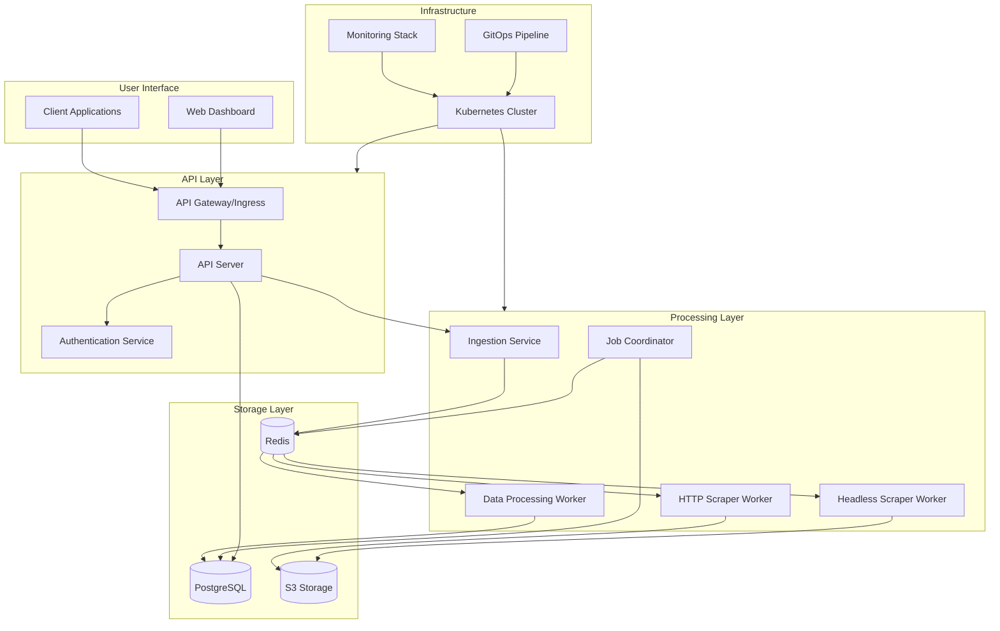

# K-Scrape Nexus: Development Design & Implementation Strategy

## Overview

K-Scrape Nexus is an enterprise-grade, hyper-scalable web scraping platform designed for massive workloads with complete automation and operational excellence. This document outlines the comprehensive development strategy, architecture, and implementation roadmap for building a production-ready system with clean, reusable code and robust testing.

## Technology Stack

### Core Components
- **Backend & Workers**: Python 3.11+ (FastAPI, Pydantic, httpx, Playwright)
- **Data Processing**: Python (Pandas/Polars for performance)
- **Database**: PostgreSQL with Alembic migrations
- **Queue & Cache**: Redis (Streams for queues, Hashes for cache)
- **Storage**: S3-Compatible Object Storage
- **Containerization**: Docker with multi-stage builds
- **Orchestration**: Kubernetes with Kustomize
- **Autoscaling**: KEDA, HPA, Cluster Autoscaler
- **GitOps**: ArgoCD for deployment automation
- **Security**: Network Policies, SOPS encryption
- **Observability**: Prometheus, Grafana, Loki, Tempo

## System Architecture



## Project Structure

```
k-scrape-nexus/
├── .gitignore
├── README.md
├── docker-compose.yml                    # Local development environment
├── pyproject.toml                        # Project configuration and dependencies
├── Makefile                             # Development automation commands
│
├── ci/
│   ├── build-images.sh                  # Container image build script
│   ├── run-tests.sh                     # Test execution script
│   └── deploy.sh                        # Deployment automation
│
├── docs/
│   ├── api/                             # API documentation
│   ├── architecture/                    # System architecture docs
│   └── deployment/                      # Deployment guides
│
├── kubernetes/
│   ├── base/                           # Base Kubernetes manifests
│   │   ├── namespace.yaml
│   │   ├── api-server/
│   │   ├── ingestion-service/
│   │   ├── workers/
│   │   ├── coordinator/
│   │   ├── monitoring/
│   │   └── shared/
│   └── overlays/                       # Environment-specific overlays
│       ├── development/
│       ├── staging/
│       └── production/
│
├── services/                           # Microservices
│   ├── shared/                         # Shared libraries
│   │   ├── scraper_lib/
│   │   │   ├── __init__.py
│   │   │   ├── database/
│   │   │   ├── cache/
│   │   │   ├── models/
│   │   │   ├── utils/
│   │   │   └── observability/
│   │   └── tests/
│   │
│   ├── api-server/
│   │   ├── app/
│   │   │   ├── __init__.py
│   │   │   ├── main.py
│   │   │   ├── routers/
│   │   │   ├── services/
│   │   │   ├── models/
│   │   │   └── middleware/
│   │   ├── tests/
│   │   ├── Dockerfile
│   │   └── requirements.txt
│   │
│   ├── ingestion-service/
│   │   ├── app/
│   │   ├── tests/
│   │   ├── Dockerfile
│   │   └── requirements.txt
│   │
│   ├── workers/
│   │   ├── http-scraper/
│   │   ├── headless-scraper/
│   │   └── data-processor/
│   │
│   └── coordinator/
│       ├── app/
│       ├── tests/
│       ├── Dockerfile
│       └── requirements.txt
│
├── infrastructure/                     # Infrastructure as Code
│   ├── terraform/
│   └── helm/
│
└── scripts/                           # Development scripts
    ├── setup.sh
    ├── test.sh
    └── deploy.sh
```

## Development Strategy

### Phase 1: Foundation & Core Infrastructure (Weeks 1-2)

#### 1.1 Project Setup
- Initialize project structure with proper Python packaging
- Configure development environment with Docker Compose
- Set up code quality tools (black, ruff, mypy, pre-commit)
- Establish CI/CD pipeline foundations

#### 1.2 Shared Library Development
- Create `scraper_lib` package with core abstractions
- Implement database models and ORM setup with Alembic
- Develop Redis client and queue management utilities
- Create observability instrumentation (metrics, logging, tracing)

#### 1.3 Development Environment
- Configure local PostgreSQL and Redis instances
- Set up S3-compatible storage (MinIO for local development)
- Implement configuration management with environment variables
- Create development Docker containers

### Phase 2: Core Services Implementation (Weeks 3-4)

#### 2.1 API Server Development
- Implement FastAPI application with proper structure
- Create authentication and authorization middleware
- Develop job submission and status endpoints
- Implement file upload with pre-signed S3 URLs
- Add comprehensive input validation with Pydantic

#### 2.2 Ingestion Service
- Build file processing and URL extraction logic
- Implement job breakdown and task creation
- Create Redis queue publishing for scraping tasks
- Add error handling and retry mechanisms

#### 2.3 Basic Worker Implementation
- Develop HTTP scraper worker with httpx
- Implement headless scraper with Playwright
- Create data processing worker foundation
- Establish worker health checks and graceful shutdown

### Phase 3: Advanced Features & Optimization (Weeks 5-6)

#### 3.1 Coordinator Service
- Implement job orchestration and state management
- Create progress tracking and status updates
- Develop failure recovery and retry logic
- Add job prioritization and scheduling

#### 3.2 Performance Optimization
- Implement connection pooling and reuse
- Add intelligent proxy rotation
- Create caching strategies for robots.txt and DNS
- Optimize data processing pipelines

#### 3.3 Data Processing Enhancement
- Implement advanced data cleaning with Pandas/Polars
- Create configurable data transformation pipelines
- Add data validation and quality checks
- Implement incremental processing capabilities

### Phase 4: Kubernetes & Production Readiness (Weeks 7-8)

#### 4.1 Containerization
- Create optimized Docker images with multi-stage builds
- Implement proper security practices in containers
- Add health checks and monitoring endpoints
- Optimize image sizes and build times

#### 4.2 Kubernetes Deployment
- Develop base Kubernetes manifests
- Implement autoscaling with HPA and KEDA
- Create network policies for zero-trust security
- Set up service mesh (if required)

#### 4.3 GitOps & CI/CD
- Configure ArgoCD for deployment automation
- Implement automated testing in CI pipeline
- Create environment promotion workflows
- Set up secret management with SOPS

### Phase 5: Observability & Security (Weeks 9-10)

#### 5.1 Monitoring Stack
- Deploy Prometheus for metrics collection
- Configure Grafana dashboards
- Set up Loki for log aggregation
- Implement distributed tracing with Tempo

#### 5.2 Security Implementation
- Configure network policies and RBAC
- Implement secret encryption and rotation
- Add security scanning to CI pipeline
- Create incident response procedures

#### 5.3 Performance Monitoring
- Implement custom metrics for business logic
- Create alerting rules and runbooks
- Set up capacity planning dashboards
- Add performance profiling capabilities

### Phase 6: Testing & Quality Assurance (Weeks 11-12)

#### 6.1 Comprehensive Testing Strategy
- Unit tests for all components (target 80%+ coverage)
- Integration tests for service interactions
- End-to-end tests for complete workflows
- Performance and load testing

#### 6.2 Quality Assurance
- Code review processes and standards
- Security vulnerability scanning
- Performance benchmarking
- Documentation review and updates

## Code Architecture & Design Patterns

### Clean Architecture Principles

#### 1. Dependency Inversion
```python
# Abstract interfaces in shared library
from abc import ABC, abstractmethod

class ScraperInterface(ABC):
    @abstractmethod
    async def scrape(self, url: str, config: ScrapingConfig) -> ScrapingResult:
        pass

class CacheInterface(ABC):
    @abstractmethod
    async def get(self, key: str) -> Optional[str]:
        pass
    
    @abstractmethod
    async def set(self, key: str, value: str, ttl: int = None) -> bool:
        pass
```

#### 2. Service Layer Pattern
```python
# Business logic encapsulation
class JobService:
    def __init__(
        self,
        job_repository: JobRepository,
        queue_service: QueueService,
        storage_service: StorageService
    ):
        self.job_repository = job_repository
        self.queue_service = queue_service
        self.storage_service = storage_service
    
    async def create_job(self, job_request: JobCreateRequest) -> Job:
        # Business logic implementation
        pass
```

#### 3. Repository Pattern
```python
# Data access abstraction
class JobRepository:
    def __init__(self, db_session: AsyncSession):
        self.db_session = db_session
    
    async def create(self, job: JobCreate) -> Job:
        pass
    
    async def get_by_id(self, job_id: UUID) -> Optional[Job]:
        pass
    
    async def update_status(self, job_id: UUID, status: JobStatus) -> bool:
        pass
```

### Reusable Components

#### 1. Configuration Management
```python
# Centralized configuration with validation
from pydantic import BaseSettings

class Settings(BaseSettings):
    database_url: str
    redis_url: str
    s3_bucket: str
    log_level: str = "INFO"
    
    class Config:
        env_file = ".env"
        case_sensitive = False
```

#### 2. Error Handling
```python
# Structured error handling
class ScraperException(Exception):
    def __init__(self, message: str, error_code: str, details: dict = None):
        self.message = message
        self.error_code = error_code
        self.details = details or {}
        super().__init__(self.message)

class RetryableError(ScraperException):
    """Errors that should trigger retry logic"""
    pass

class FatalError(ScraperException):
    """Errors that should not be retried"""
    pass
```

#### 3. Observability Integration
```python
# Metrics and tracing decorators
from functools import wraps
import time
from prometheus_client import Counter, Histogram

def monitor_performance(operation_name: str):
    def decorator(func):
        @wraps(func)
        async def wrapper(*args, **kwargs):
            start_time = time.time()
            try:
                result = await func(*args, **kwargs)
                success_counter.labels(operation=operation_name).inc()
                return result
            except Exception as e:
                error_counter.labels(
                    operation=operation_name,
                    error_type=type(e).__name__
                ).inc()
                raise
            finally:
                duration = time.time() - start_time
                duration_histogram.labels(operation=operation_name).observe(duration)
        return wrapper
    return decorator
```

## Testing Strategy

### Unit Testing Framework
```python
# Comprehensive test structure
import pytest
from unittest.mock import AsyncMock, Mock
from fastapi.testclient import TestClient

@pytest.fixture
async def mock_job_repository():
    return AsyncMock(spec=JobRepository)

@pytest.fixture
async def job_service(mock_job_repository, mock_queue_service):
    return JobService(
        job_repository=mock_job_repository,
        queue_service=mock_queue_service,
        storage_service=Mock()
    )

class TestJobService:
    async def test_create_job_success(self, job_service, sample_job_request):
        # Arrange
        expected_job = Job(id=uuid4(), status=JobStatus.PENDING)
        job_service.job_repository.create.return_value = expected_job
        
        # Act
        result = await job_service.create_job(sample_job_request)
        
        # Assert
        assert result.id == expected_job.id
        assert result.status == JobStatus.PENDING
        job_service.job_repository.create.assert_called_once()
```

### Integration Testing
```python
# Database and service integration tests
@pytest.mark.integration
class TestJobRepositoryIntegration:
    async def test_job_lifecycle(self, test_db_session):
        # Test complete job workflow with real database
        repository = JobRepository(test_db_session)
        
        job_data = JobCreate(name="test-job", urls=["http://example.com"])
        created_job = await repository.create(job_data)
        
        retrieved_job = await repository.get_by_id(created_job.id)
        assert retrieved_job.name == "test-job"
        
        updated = await repository.update_status(created_job.id, JobStatus.RUNNING)
        assert updated is True
```

### End-to-End Testing
```python
# Complete workflow testing
@pytest.mark.e2e
class TestScrapingWorkflow:
    async def test_complete_scraping_job(self, test_client, test_redis, test_s3):
        # 1. Submit job
        response = test_client.post("/jobs", json={"urls": ["http://httpbin.org/json"]})
        job_id = response.json()["id"]
        
        # 2. Wait for processing
        await asyncio.sleep(5)
        
        # 3. Check results
        response = test_client.get(f"/jobs/{job_id}")
        assert response.json()["status"] == "completed"
        
        # 4. Verify data storage
        results = await test_s3.get_object(bucket="test", key=f"results/{job_id}.json")
        assert results is not None
```

### Performance Testing
```python
# Load and performance testing
@pytest.mark.performance
class TestPerformance:
    async def test_api_response_time(self, test_client):
        """Ensure API responds within acceptable time limits"""
        start_time = time.time()
        response = test_client.get("/health")
        duration = time.time() - start_time
        
        assert response.status_code == 200
        assert duration < 0.1  # 100ms SLA
    
    async def test_concurrent_job_submission(self, test_client):
        """Test system handles concurrent job submissions"""
        async def submit_job():
            return test_client.post("/jobs", json={"urls": ["http://example.com"]})
        
        # Submit 100 concurrent jobs
        tasks = [submit_job() for _ in range(100)]
        responses = await asyncio.gather(*tasks)
        
        success_count = sum(1 for r in responses if r.status_code == 201)
        assert success_count >= 95  # 95% success rate minimum
```

## Production Deployment Strategy

### Multi-Environment Configuration

#### Development Environment
- Local Docker Compose setup
- Reduced resource requirements
- Debug logging enabled
- Hot reloading for rapid development

#### Staging Environment
- Production-like Kubernetes setup
- Limited scaling for cost optimization
- Full observability stack
- Automated testing deployment

#### Production Environment
- Full autoscaling capabilities
- High availability configuration
- Security hardening enabled
- Comprehensive monitoring and alerting

### Deployment Automation

#### GitOps Workflow
```yaml
# .github/workflows/deploy.yml
name: Deploy to Kubernetes
on:
  push:
    branches: [main]

jobs:
  test:
    runs-on: ubuntu-latest
    steps:
      - uses: actions/checkout@v3
      - name: Run tests
        run: make test
      
  build:
    needs: test
    runs-on: ubuntu-latest
    steps:
      - name: Build and push images
        run: make build-images
        
  deploy-staging:
    needs: build
    runs-on: ubuntu-latest
    steps:
      - name: Deploy to staging
        run: make deploy-staging
        
  deploy-production:
    needs: deploy-staging
    if: github.ref == 'refs/heads/main'
    runs-on: ubuntu-latest
    environment: production
    steps:
      - name: Deploy to production
        run: make deploy-production
```

### Monitoring & Alerting

#### Key Metrics
- **System Health**: CPU, memory, disk usage
- **Application Performance**: Request latency, throughput, error rates
- **Business Metrics**: Jobs completed, scraping success rate, data quality
- **Infrastructure**: Queue lengths, database connections, storage usage

#### Alert Rules
- High error rates (>5% over 5 minutes)
- Response time degradation (>2s 95th percentile)
- Queue backlog growing (>1000 pending tasks)
- Worker failures (>10% failure rate)
- Storage capacity warnings (>80% usage)

### Security Considerations

#### Network Security
- Zero-trust network policies
- Encrypted service-to-service communication
- Regular security scans and updates
- Intrusion detection and prevention

#### Data Protection
- Encryption at rest and in transit
- PII data handling compliance
- Secure secret management
- Regular backup and recovery testing

#### Access Control
- Role-based access control (RBAC)
- Multi-factor authentication
- Audit logging for all administrative actions
- Regular access reviews and cleanup