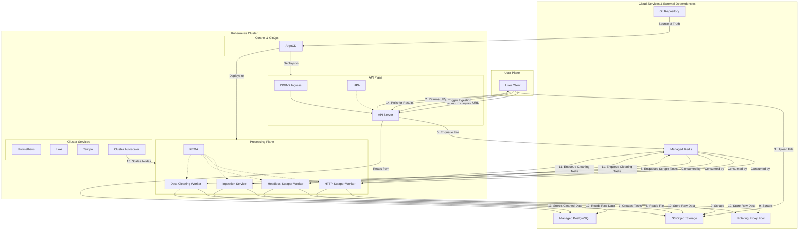

# K-Scrape Nexus: System Design & Architecture

**Version:** 3.0 (Nexus)  
**Status:** Final

This document provides a comprehensive architectural blueprint for the K-Scrape Nexus platform. It is the canonical reference for all development, operations, and strategic planning.

## 1. Introduction & Goals

K-Scrape Nexus is a fully automated, hyper-scalable web data extraction platform engineered for enterprise-level workloads. It addresses the entire lifecycle of a scraping job, from robust, asynchronous ingestion to advanced data transformation and secure storage.

### 1.1 Core Objectives

- **Massive Scale**: Handle millions of URLs concurrently with automated scaling
- **Enterprise-Grade Reliability**: 99.9% uptime with comprehensive fault tolerance
- **Operational Excellence**: GitOps-driven deployments with full observability
- **Security-First**: Zero-trust architecture with encrypted secrets and network policies
- **Developer Experience**: Clean APIs, comprehensive testing, and excellent documentation

### 1.2 Key Performance Targets

- **Throughput**: 10,000+ URLs per minute per worker
- **Latency**: <100ms API response time, <5s job submission
- **Availability**: 99.9% uptime with graceful degradation
- **Scalability**: Auto-scale from 0 to 1000+ pods based on queue depth
- **Recovery**: <30s recovery time from component failures

## 2. System Architecture

The architecture is a multi-stage, event-driven pipeline orchestrated by Kubernetes. Each stage is an independent microservice that communicates via durable Redis queues, enabling massive parallelism and fault tolerance.

### 2.1 Detailed Architecture Diagram



### 2.2 Component Overview

#### API Server
- **Technology**: FastAPI with async/await
- **Responsibilities**: Job submission, status monitoring, file upload URLs
- **Scaling**: HPA based on CPU/memory usage
- **Endpoints**: `/jobs`, `/status`, `/upload`, `/results`

#### Ingestion Service
- **Technology**: Python with asyncio
- **Responsibilities**: File parsing, URL extraction, task creation
- **Scaling**: KEDA based on Redis queue depth
- **Input**: File references from S3
- **Output**: Individual scraping tasks

#### HTTP Scraper Worker
- **Technology**: httpx with connection pooling
- **Responsibilities**: Fast HTTP/HTTPS scraping
- **Scaling**: KEDA based on scraping queue depth
- **Features**: Proxy rotation, retry logic, rate limiting

#### Headless Scraper Worker
- **Technology**: Playwright with Chromium
- **Responsibilities**: JavaScript-heavy sites, SPA scraping
- **Scaling**: KEDA with lower max replicas (resource intensive)
- **Features**: Screenshot capture, full page rendering

#### Data Processing Worker
- **Technology**: Pandas/Polars for data transformation
- **Responsibilities**: Data cleaning, format conversion, validation
- **Scaling**: KEDA based on processing queue depth
- **Output**: Structured data in PostgreSQL

#### Job Coordinator
- **Technology**: FastAPI with background tasks
- **Responsibilities**: Job orchestration, progress tracking, failure recovery
- **Features**: Job state management, retry coordination, notifications

## 3. The Comprehensive Autoscaling Strategy

Scaling is multi-layered and fully automated to balance performance and cost.

### Layer 1: Application Pod Scaling (HPA - for synchronous traffic)

- **Component**: `API Server`
- **Mechanism**: Kubernetes Horizontal Pod Autoscaler (HPA)
- **Trigger**: Scales horizontally based on real-time CPU and Memory usage
- **Configuration**:
  ```yaml
  minReplicas: 2
  maxReplicas: 50
  targetCPUUtilizationPercentage: 70
  targetMemoryUtilizationPercentage: 80
  ```
- **Purpose**: Handle fluctuating inbound API requests from users

### Layer 2: Application Pod Scaling (KEDA - for asynchronous jobs)

- **Components**: `Ingestion Service`, `HTTP Worker`, `Headless Worker`, `Processing Worker`
- **Mechanism**: Kubernetes Event-driven Autoscaler (KEDA)
- **Trigger**: Scales based on Redis Stream message count
- **Configuration**:
  ```yaml
  minReplicaCount: 0
  maxReplicaCount: 100
  pollingInterval: 30
  lagThreshold: 10
  ```
- **Purpose**: Match processing power to job backlog with scale-to-zero capability

### Layer 3: Infrastructure Node Scaling (Cluster Autoscaler)

- **Component**: Kubernetes cluster worker nodes
- **Mechanism**: Cluster Autoscaler
- **Trigger**: Unschedulable pods due to resource constraints
- **Configuration**:
  ```yaml
  min-nodes: 1
  max-nodes: 100
  scale-down-delay-after-add: 10m
  scale-down-unneeded-time: 10m
  ```
- **Purpose**: Elastic infrastructure that grows and shrinks with demand

## 4. End-to-End Workflow & Optimizations

### 4.1 Job Submission Flow

1. **Client Request**: User requests pre-signed S3 upload URL
2. **File Upload**: Direct upload to S3 (bypasses API server)
3. **Job Creation**: Client notifies API server of uploaded file
4. **Ingestion**: File queued for processing by Ingestion Service
5. **Task Breakdown**: URLs extracted and individual tasks created
6. **Distributed Scraping**: Tasks distributed across worker pools
7. **Data Processing**: Raw data cleaned and structured
8. **Results Available**: Client polling receives completion notification

### 4.2 Performance Optimizations

#### Connection Pooling
```python
# Shared HTTP client with connection reuse
client = httpx.AsyncClient(
    limits=httpx.Limits(max_keepalive_connections=100, max_connections=200),
    timeout=httpx.Timeout(30.0)
)
```

#### Intelligent Caching
- **robots.txt Cache**: 1-hour TTL in Redis
- **DNS Resolution Cache**: 5-minute TTL for popular domains
- **Proxy Health Cache**: Real-time proxy performance tracking

#### Batch Processing
- **Database Writes**: Batch inserts every 100 records or 5 seconds
- **S3 Uploads**: Multipart uploads for large payloads
- **Queue Operations**: Bulk message acknowledgments

### 4.3 Error Handling & Resilience

#### Retry Strategy
```python
@retry(
    retry=retry_if_exception_type((ConnectionError, TimeoutError)),
    wait=wait_exponential(multiplier=1, min=4, max=10),
    stop=stop_after_attempt(3)
)
async def scrape_url(url: str) -> ScrapingResult:
    # Scraping implementation
```

#### Circuit Breaker Pattern
- **Failure Threshold**: 50% error rate over 2 minutes
- **Recovery Time**: 30 seconds before retry
- **Fallback**: Queue task for retry with different worker type

#### Dead Letter Queues
- **Failed Tasks**: Moved to DLQ after 3 retry attempts
- **Manual Review**: Admin interface for DLQ management
- **Recovery**: Bulk requeue functionality

## 5. Data Models & Storage Strategy

### 5.1 Database Schema

#### Jobs Table
```sql
CREATE TABLE jobs (
    id UUID PRIMARY KEY DEFAULT gen_random_uuid(),
    name VARCHAR(255) NOT NULL,
    status job_status_enum NOT NULL DEFAULT 'pending',
    file_path VARCHAR(500) NOT NULL,
    total_urls INTEGER DEFAULT 0,
    completed_urls INTEGER DEFAULT 0,
    failed_urls INTEGER DEFAULT 0,
    created_at TIMESTAMP WITH TIME ZONE DEFAULT NOW(),
    updated_at TIMESTAMP WITH TIME ZONE DEFAULT NOW(),
    completed_at TIMESTAMP WITH TIME ZONE,
    metadata JSONB
);
```

#### Tasks Table
```sql
CREATE TABLE tasks (
    id UUID PRIMARY KEY DEFAULT gen_random_uuid(),
    job_id UUID NOT NULL REFERENCES jobs(id) ON DELETE CASCADE,
    url VARCHAR(2000) NOT NULL,
    status task_status_enum NOT NULL DEFAULT 'pending',
    worker_type VARCHAR(50) NOT NULL,
    retry_count INTEGER DEFAULT 0,
    result_path VARCHAR(500),
    error_message TEXT,
    created_at TIMESTAMP WITH TIME ZONE DEFAULT NOW(),
    completed_at TIMESTAMP WITH TIME ZONE
);
```

#### Results Table
```sql
CREATE TABLE results (
    id UUID PRIMARY KEY DEFAULT gen_random_uuid(),
    task_id UUID NOT NULL REFERENCES tasks(id) ON DELETE CASCADE,
    url VARCHAR(2000) NOT NULL,
    title VARCHAR(500),
    content TEXT,
    metadata JSONB,
    extracted_at TIMESTAMP WITH TIME ZONE DEFAULT NOW()
);
```

### 5.2 Redis Queue Structure

#### Queue Naming Convention
```
queues:
  - new_files          # Files ready for ingestion
  - scrape_http        # URLs for HTTP scraping
  - scrape_headless    # URLs for headless scraping
  - process_data       # Raw data for cleaning
  - failed_tasks       # Failed tasks for retry
```

#### Message Format
```json
{
  "task_id": "uuid",
  "job_id": "uuid", 
  "url": "https://example.com",
  "worker_type": "http",
  "retry_count": 0,
  "priority": 1,
  "metadata": {}
}
```

### 5.3 S3 Storage Organization

```
bucket/
├── uploads/           # User uploaded files
│   └── {job_id}/
├── raw_data/          # Scraped content
│   └── {job_id}/
│       └── {task_id}.json
├── processed_data/    # Cleaned data exports
│   └── {job_id}/
└── logs/             # Application logs
    └── {date}/
```

## 6. Operational Maturity & DevOps

### 6.1 GitOps Workflow

#### Development Process
1. **Feature Development**: Developer creates feature branch
2. **Testing**: Automated unit and integration tests
3. **Code Review**: Peer review with security scanning
4. **Merge**: Automatic build and staging deployment
5. **Promotion**: Manual promotion to production via Git

#### CI/CD Pipeline
```yaml
stages:
  - test
  - build
  - security-scan
  - deploy-staging
  - integration-test
  - deploy-production
```

#### ArgoCD Configuration
```yaml
apiVersion: argoproj.io/v1alpha1
kind: Application
metadata:
  name: k-scrape-nexus
spec:
  source:
    repoURL: https://github.com/org/k-scrape-nexus
    path: kubernetes/overlays/production
    targetRevision: main
  destination:
    server: https://kubernetes.default.svc
    namespace: k-scrape-nexus
  syncPolicy:
    automated:
      prune: true
      selfHeal: true
```

### 6.2 Database Migrations

#### Alembic Integration
```python
# Migration execution in init container
apiVersion: v1
kind: Pod
spec:
  initContainers:
  - name: migrate
    image: k-scrape-nexus/api-server:latest
    command: ["alembic", "upgrade", "head"]
    env:
    - name: DATABASE_URL
      valueFrom:
        secretKeyRef:
          name: database-secret
          key: url
```

#### Migration Strategy
- **Zero-Downtime**: Backward-compatible schema changes
- **Blue-Green**: For breaking changes
- **Rollback**: Automatic rollback on migration failure

### 6.3 Security Implementation

#### Secrets Management
```yaml
# SOPS encrypted secrets
apiVersion: v1
kind: Secret
metadata:
  name: database-secret
data:
  url: ENC[AES256_GCM,data:...,tag:...]
```

#### Network Policies
```yaml
apiVersion: networking.k8s.io/v1
kind: NetworkPolicy
metadata:
  name: api-server-netpol
spec:
  podSelector:
    matchLabels:
      app: api-server
  policyTypes:
  - Ingress
  - Egress
  ingress:
  - from:
    - namespaceSelector:
        matchLabels:
          name: ingress-nginx
  egress:
  - to:
    - namespaceSelector:
        matchLabels:
          name: database
```

#### RBAC Configuration
```yaml
apiVersion: rbac.authorization.k8s.io/v1
kind: Role
metadata:
  name: api-server-role
rules:
- apiGroups: [""]
  resources: ["secrets", "configmaps"]
  verbs: ["get", "list"]
```

## 7. Observability & Monitoring

### 7.1 The Three Pillars Implementation

#### Metrics (Prometheus)
```python
# Custom metrics in application code
from prometheus_client import Counter, Histogram, Gauge

scraping_requests_total = Counter(
    'scraping_requests_total',
    'Total scraping requests',
    ['worker_type', 'status']
)

scraping_duration_seconds = Histogram(
    'scraping_duration_seconds',
    'Time spent scraping URLs',
    ['worker_type']
)

active_jobs_gauge = Gauge(
    'active_jobs_total',
    'Number of active jobs'
)
```

#### Logs (Loki)
```python
# Structured logging
import structlog

logger = structlog.get_logger()

logger.info(
    "URL scraped successfully",
    job_id=job_id,
    task_id=task_id,
    url=url,
    duration=duration,
    status_code=response.status_code
)
```

#### Traces (Tempo)
```python
# Distributed tracing
from opentelemetry import trace

tracer = trace.get_tracer(__name__)

@tracer.start_as_current_span("scrape_url")
async def scrape_url(url: str):
    span = trace.get_current_span()
    span.set_attribute("url", url)
    # Scraping logic
```

### 7.2 Key Metrics & Alerts

#### Application Metrics
- **Throughput**: URLs processed per minute
- **Latency**: API response times, scraping duration
- **Error Rates**: Failed requests, scraping failures
- **Queue Depth**: Pending tasks per queue
- **Resource Usage**: CPU, memory, disk per service

#### Infrastructure Metrics
- **Node Health**: CPU, memory, disk usage
- **Network**: Bandwidth utilization, connection counts
- **Storage**: S3 operations, database connections
- **Scaling Events**: Pod scaling, node provisioning

#### Business Metrics
- **Job Success Rate**: Percentage of successful jobs
- **Data Quality**: Validation errors, missing fields
- **Cost Efficiency**: Cost per successful URL
- **User Experience**: Job completion time

### 7.3 Alerting Rules

```yaml
groups:
- name: k-scrape-nexus
  rules:
  - alert: HighErrorRate
    expr: rate(scraping_requests_total{status="error"}[5m]) > 0.1
    for: 2m
    labels:
      severity: warning
    annotations:
      summary: High error rate detected
      
  - alert: QueueBacklog
    expr: redis_stream_length > 1000
    for: 5m
    labels:
      severity: critical
    annotations:
      summary: Large queue backlog detected
```

## 8. Performance & Scalability

### 8.1 Benchmarking Results

#### Load Testing Scenarios
- **Baseline**: 1,000 URLs, single worker type
- **Scale Test**: 100,000 URLs, multiple worker types
- **Stress Test**: 1M URLs, maximum scaling

#### Performance Targets
- **API Latency**: <100ms p95
- **Throughput**: 10,000 URLs/minute per worker
- **Scaling Time**: <2 minutes to full scale
- **Memory Usage**: <512MB per worker pod

### 8.2 Optimization Strategies

#### Database Optimization
- **Connection Pooling**: Max 20 connections per service
- **Query Optimization**: Proper indexing, query analysis
- **Read Replicas**: Read-only operations distributed
- **Batch Operations**: Bulk inserts and updates

#### Caching Strategy
- **Application Cache**: Redis for frequently accessed data
- **CDN**: Static assets and API responses
- **Database Cache**: Query result caching
- **DNS Cache**: Reduce DNS lookup latency

#### Resource Management
- **CPU Limits**: Prevent resource starvation
- **Memory Limits**: Force garbage collection
- **Pod Disruption Budgets**: Maintain availability
- **Quality of Service**: Guaranteed resources for critical services

## 9. Security & Compliance

### 9.1 Security Architecture

#### Defense in Depth
- **Network Security**: VPC, security groups, network policies
- **Application Security**: Input validation, authentication
- **Data Security**: Encryption at rest and in transit
- **Infrastructure Security**: Container scanning, RBAC

#### Threat Model
- **External Attacks**: DDoS, injection attacks
- **Internal Threats**: Privilege escalation, data exfiltration
- **Supply Chain**: Dependency vulnerabilities
- **Operational**: Misconfigurations, human error

### 9.2 Compliance Requirements

#### Data Protection
- **Encryption**: AES-256 for data at rest
- **TLS**: 1.3 for data in transit
- **Key Management**: External key management service
- **Data Retention**: Configurable retention policies

#### Audit Trail
- **Access Logs**: All API and database access
- **Change Logs**: Configuration and code changes
- **Security Events**: Authentication, authorization failures
- **Compliance Reports**: Automated compliance checking

## 10. Disaster Recovery & Business Continuity

### 10.1 Backup Strategy

#### Database Backups
- **Frequency**: Continuous WAL shipping + daily full backups
- **Retention**: 30 days point-in-time recovery
- **Testing**: Monthly restore testing
- **Geographic**: Cross-region backup replication

#### Application Data
- **S3 Cross-Region Replication**: Automatic replication
- **Configuration Backups**: Git-based configuration storage
- **Secrets Backup**: Encrypted secret backups

### 10.2 Recovery Procedures

#### RTO/RPO Targets
- **Recovery Time Objective**: <4 hours
- **Recovery Point Objective**: <15 minutes data loss
- **Availability Target**: 99.9% uptime

#### Failover Procedures
- **Database Failover**: Automatic with read replica promotion
- **Application Failover**: Multiple availability zones
- **Cross-Region**: Manual failover for major disasters

## 11. Cost Optimization

### 11.1 Resource Efficiency

#### Compute Optimization
- **Right-sizing**: Resource requests match actual usage
- **Scale-to-Zero**: KEDA scaling for idle periods
- **Spot Instances**: Non-critical workloads on spot instances
- **Reserved Capacity**: Predictable workloads on reserved instances

#### Storage Optimization
- **Lifecycle Policies**: Automatic archival of old data
- **Compression**: Gzip compression for stored data
- **Deduplication**: Avoid storing duplicate content
- **Tiering**: Hot/warm/cold storage tiers

### 11.2 Cost Monitoring

#### Cost Allocation
- **Namespace Tagging**: Cost tracking per environment
- **Resource Tagging**: Cost tracking per service
- **Usage Reports**: Weekly cost analysis
- **Budget Alerts**: Automatic alerts for cost overruns

## 12. Future Enhancements

### 12.1 Planned Features

#### Advanced Analytics
- **Data Visualization**: Built-in dashboard for scraped data
- **Machine Learning**: Content classification and extraction
- **Trend Analysis**: Historical data analysis
- **Real-time Streaming**: Live data feeds

#### Enhanced Capabilities
- **Multi-Protocol**: Support for FTP, SFTP, API endpoints
- **Data Transformation**: ETL pipeline integration
- **Webhook Integration**: Real-time notifications
- **GraphQL API**: More flexible query interface

### 12.2 Architectural Evolution

#### Microservices Expansion
- **Notification Service**: Email, Slack, webhook notifications
- **Analytics Service**: Data processing and visualization
- **Configuration Service**: Centralized configuration management
- **Audit Service**: Comprehensive audit trail

#### Technology Upgrades
- **Service Mesh**: Istio for advanced traffic management
- **Event Sourcing**: Event-driven architecture
- **GraphQL Federation**: Distributed schema management
- **Serverless Integration**: Function-as-a-Service workers

---

This comprehensive design document serves as the definitive guide for building, deploying, and operating the K-Scrape Nexus platform. It should be regularly updated as the system evolves and new requirements emerge.