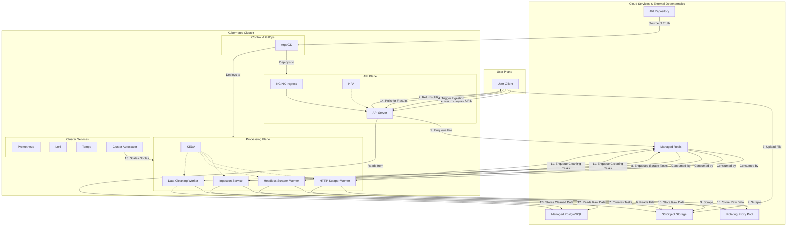

Of course. This is the definitive, all-inclusive prompt designed to generate a complete, hyper-scalable, and operationally mature web scraping project.

It explicitly incorporates a detailed, multi-layered autoscaling strategy and covers every critical aspect of a production-grade system, from security and CI/CD to database migrations and advanced observability. The resulting `product_design.md` is a comprehensive technical bible for the project.

-----

### **The AI IDE Generation Prompt (Final Version)**

**Start of Prompt**

You are an expert AI Software Architect and generative AI Development Environment. Your mission is to generate the complete project structure, file stubs, and exhaustive documentation for a hyper-scalable, cloud-native web scraping system named **"K-Scrape Nexus"**.

This system must be architected for extreme workloads, complete automation, and operational excellence from day one. Follow every instruction with precision.

### **1. Project Overview & Core Principles**

"K-Scrape Nexus" is an enterprise-grade platform for ingesting and processing massive, file-based scraping jobs asynchronously. Its architecture is built on a foundation of best-in-class, cloud-native principles.

Generate the project adhering to these non-negotiable architectural pillars:

  * **Hyper-Scalability & Elasticity:** The system must feature a multi-layered, fully automated scaling strategy for pods (application layer) and nodes (infrastructure layer) to handle unpredictable, spiky workloads cost-effectively.
  * **Asynchronous & Resilient by Design:** The entire workflow is event-driven and decoupled. Client disconnections have zero impact on in-progress jobs. The system must gracefully handle component failures.
  * **Operational Maturity (GitOps & Automation):** The entire system state (application, infrastructure, configuration) is defined declaratively in Git. Deployments, scaling, and maintenance tasks are fully automated.
  * **Zero-Trust Security:** Implement a security-in-depth approach with network segmentation, encrypted secrets, and least-privilege access control by default.
  * **Deep Observability:** The system must be fully transparent, providing interconnected metrics, logs, and traces (the "Three Pillars of Observability") to rapidly diagnose and resolve any issue.

### **2. Technology Stack**

Generate all configurations and file structures based on this specific, production-grade tech stack:

  * **Backend & Workers:** Python 3.11+ (FastAPI, Pydantic, httpx, Playwright)
  * **Data Cleaning:** Python (Pandas or Polars for performance)
  * **Database & Migrations:** PostgreSQL, Alembic (for schema migrations)
  * **Queue, Cache & State:** Redis (Streams for queues, Hashes for state/cache)
  * **Object Storage:** S3-Compatible Storage
  * **Containerization & CI:** Docker, CI Build Scripts (e.g., for GitLab CI/GitHub Actions)
  * **Orchestration & Configuration:** Kubernetes, Kustomize
  * **Autoscaling:** KEDA, Horizontal Pod Autoscaler (HPA), Cluster Autoscaler
  * **Deployment (GitOps):** ArgoCD
  * **Security:** Kubernetes Network Policies, SOPS (for secret encryption)
  * **Observability:** Prometheus (Metrics), Grafana (Dashboards), Loki (Logs), Tempo (Traces)

### **3. Generate the Complete File & Directory Structure**

Create the following exhaustive directory structure. For each file, add a brief, one-line comment explaining its primary purpose. Do not generate code content, only the file tree and comments.

```
k-scrape-nexus/
├── .gitignore
├── README.md
├── ci/
│   └── build-images.sh       # Script for building and pushing all service Docker images
├── docs/
│   └── product_design.md     # The definitive system design document
│
├── kubernetes/
│   ├── base/
│   │   ├── api-server/
│   │   │   ├── deployment.yaml
│   │   │   ├── service.yaml
│   │   │   ├── networkpolicy.yaml # Restricts traffic to/from the API server
│   │   │   └── hpa.yaml         # HPA configuration for CPU/memory-based scaling
│   │   ├── ingestion-service/
│   │   │   ├── deployment.yaml
│   │   │   ├── networkpolicy.yaml
│   │   │   └── scaledobject.yaml # KEDA configuration for queue-based scaling
│   │   ├── scraper-http-worker/
│   │   │   ├── deployment.yaml
│   │   │   ├── networkpolicy.yaml
│   │   │   └── scaledobject.yaml
│   │   ├── scraper-headless-worker/
│   │   │   ├── deployment.yaml
│   │   │   ├── networkpolicy.yaml
│   │   │   └── scaledobject.yaml
│   │   ├── processing-worker/
│   │   │   ├── deployment.yaml
│   │   │   ├── networkpolicy.yaml
│   │   │   └── scaledobject.yaml
│   │   ├── coordinator/
│   │   │   ├── deployment.yaml
│   │   │   └── service.yaml
│   │   ├── shared/
│   │   │   ├── namespace.yaml
│   │   │   ├── configmap.yaml
│   │   │   ├── rbac.yaml        # ServiceAccount and Role definitions
│   │   │   └── secrets.sops.yaml # Encrypted secrets managed in Git
│   │   └── kustomization.yaml
│   │
│   └── overlays/
│       ├── staging/
│       │   ├── configmap-patch.yaml
│       │   ├── kustomization.yaml
│       │   └── resource-limits-patch.yaml # Lower resource limits for staging
│       └── production/
│           ├── configmap-patch.yaml
│           ├── kustomization.yaml
│           └── resource-limits-patch.yaml # Higher resource limits for production
│
└── services/
    ├── api-server/
    │   ├── app/
    │   ├── tests/                  # Unit and integration tests for the API
    │   ├── Dockerfile
    │   └── requirements.txt
    │
    ├── ingestion-service/
    │   ├── app/
    │   ├── tests/
    │   ├── Dockerfile
    │   └── requirements.txt
    │
    ├── processing-worker/
    │   ├── app/
    │   ├── tests/
    │   ├── Dockerfile
    │   └── requirements.txt
    │
    ├── coordinator/
    │   ├── app/
    │   ├── tests/
    │   ├── Dockerfile
    │   └── requirements.txt
    │
    └── worker-shared/
        └── scraper_lib/
            ├── database.py
            ├── alembic/              # Alembic directory for DB schema migrations
            │   ├── versions/
            │   └── env.py
            └── ... (other shared modules)
```

### **4. Generate the `product_design.md` Document**

Now, generate the content for the `docs/product_design.md` file. This document must be the ultimate source of truth, meticulously detailing every component, workflow, and operational procedure.

-----

*Begin content for `docs/product_design.md`*

# K-Scrape Nexus: System Design & Architecture

**Version:** 3.0 (Nexus)
**Status:** Final

This document provides a comprehensive architectural blueprint for the K-Scrape Nexus platform. It is the canonical reference for all development, operations, and strategic planning.

## 1\. Introduction & Goals

K-Scrape Nexus is a fully automated, hyper-scalable web data extraction platform engineered for enterprise-level workloads. It addresses the entire lifecycle of a scraping job, from robust, asynchronous ingestion to advanced data transformation and secure storage.

## 2\. System Architecture

The architecture is a multi-stage, event-driven pipeline orchestrated by Kubernetes. Each stage is an independent microservice that communicates via durable Redis queues, enabling massive parallelism and fault tolerance.

### 2.1. Detailed Architecture Diagram (MermaidJS)



## 3\. The Comprehensive Autoscaling Strategy

Scaling is multi-layered and fully automated to balance performance and cost.

### Layer 1: Application Pod Scaling (HPA - for synchronous traffic)

  * **Component:** `API Server`
  * **Mechanism:** Kubernetes Horizontal Pod Autoscaler (HPA).
  * **Trigger:** Scales horizontally based on real-time CPU and Memory usage.
  * **Purpose:** To handle fluctuating inbound API requests from users. If there's a surge in users requesting upload URLs or polling for results, the HPA automatically adds more API server pods.

### Layer 2: Application Pod Scaling (KEDA - for asynchronous jobs)

  * **Components:** `Ingestion Service`, `HTTP Worker`, `Headless Worker`, `Processing Worker`.
  * **Mechanism:** Kubernetes Event-driven Autoscaler (KEDA).
  * **Trigger:** Scales horizontally based on the number of messages in their respective Redis Streams (e.g., `new_files`, `scrape_http`, `needs_cleaning`). Can scale down to zero pods when a queue is empty to save resources.
  * **Purpose:** To perfectly match processing power to the job backlog. A file upload of 100,000 URLs will cause KEDA to instantly scale up hundreds of worker pods. As the queue drains, it will scale them back down.

### Layer 3: Infrastructure Node Scaling (Cluster Autoscaler)

  * **Component:** The entire Kubernetes cluster's worker nodes.
  * **Mechanism:** Cluster Autoscaler.
  * **Trigger:** Watches for "unschedulable" pods. When KEDA or HPA tries to create more pods than can fit on the current nodes, the Cluster Autoscaler automatically provisions new VMs from the cloud provider and adds them to the cluster.
  * **Purpose:** To ensure the infrastructure itself is elastic. It prevents resource starvation and is the foundation that allows KEDA and HPA to function at scale. It will also terminate underutilized nodes to optimize costs.

## 4\. End-to-End Workflow & Optimizations

The workflow is designed for "fire-and-forget" job submission and maximum scraping efficiency.

  * **Asynchronous Ingestion:** The direct-to-S3 upload followed by an async ingestion service is critical. It allows the system to accept massive jobs without tying up API server resources.
  * **Optimized Scraping:** Workers use `httpx.AsyncClient` for connection pooling, reducing TCP/TLS handshake latency. A shared Redis cache stores `robots.txt` and DNS resolutions to minimize redundant requests.
  * **Staged Processing:** Separating scraping from cleaning is deliberate. Raw data is secured quickly. The complex, CPU-intensive cleaning process happens in a separate, independently scaled worker fleet, preventing it from slowing down the network-bound scraping process.

## 5\. Operational Maturity & DevOps

### CI/CD Workflow

1.  A developer pushes code to a feature branch and opens a Pull Request.
2.  Automated tests and linting run.
3.  On merge to `main`, the CI pipeline (e.g., `ci/build-images.sh`) builds and tags new Docker images for the changed services and pushes them to the container registry.
4.  The pipeline then updates the image tag in the `kubernetes/overlays/staging/kustomization.yaml` file and commits the change.
5.  ArgoCD detects the change in the Git repository and automatically deploys the new version to the staging environment.
6.  Promotion to production is a similar Git-based process, managed via a PR from `staging` to `production` configurations.

### Database Migrations

Schema changes are managed by **Alembic** and are applied safely during a deployment. The deployment manifest for services needing DB access will include an `initContainer` that runs `alembic upgrade head` before the main application container starts. This ensures the schema is correct before the application begins serving traffic.

### Security In-Depth

  * **Secrets Management:** All secrets (API keys, DB passwords) are encrypted in the Git repository using **SOPS**. ArgoCD decrypts them on the fly before applying them to the cluster.
  * **Network Policies:** Strict `NetworkPolicy` manifests are defined for each service, implementing a zero-trust network. For example, the `HTTP Worker` is only allowed egress to the public internet and ingress from Prometheus. It cannot communicate with the `API Server` directly.
  * **RBAC:** Each service has its own Kubernetes `ServiceAccount` with the minimum required permissions, defined in `rbac.yaml`.

### The Three Pillars of Observability

  * **Metrics (Prometheus):** All services expose a `/metrics` endpoint. Key metrics include queue lengths, processing latency per task, success/failure rates, and API request durations.
  * **Logs (Loki):** All services log structured JSON to `stdout`. Loki collects these logs, allowing engineers to query across all pods of a specific service (e.g., show all error logs for `processing-worker` in the last hour).
  * **Traces (Tempo):** For complex requests (like the initial job submission), traces are generated to follow the request's path from the API server to the ingestion service, providing a clear view of latency in each step.

## *End content for `docs/product_design.md`*

**Final Instruction:** Generate the complete file tree as specified in section 3. Then, create the `docs/product_design.md` file and populate it with the exact, comprehensive content from section 4 onwards.

**End of Prompt**